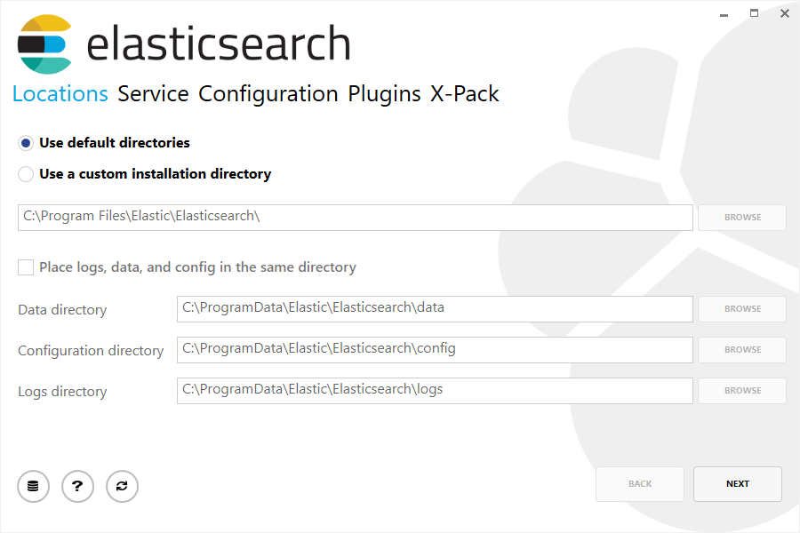

<h2>Getting started with Elasticsearch</h2>

准备好接受ElasticSearch进行试驾了吗？自己看看如何使用RESTAPI来存储、搜索和分析数据？

逐步学习本入门教程：

*启动并运行ElasticSearch实例  
*索引一些示例文档  
*使用ElasticSearch查询语言搜索文档  
*使用bucket和metrics聚合分析结果  

需要更多上下文？

查看ElasticSearch简介，了解ElasticSearch的行话，了解ElasticSearch的工作原理。如果您已经熟悉ElasticSearch，并且希望了解它如何与堆栈的其余部分一起工作，那么您可能希望跳到ElasticSearch教程，了解如何使用ElasticSearch、Kibana、Beats和Logstash设置系统监控解决方案。

TIP:启动ElasticSearch的最快方法是在云中启动一个为期14天的免费ElasticSearch服务试用。

<h3>Installation</h3>

TIP:您可以不必在弹性云上使用我们的托管弹性搜索服务来安装ElasticSearch。ElasticSearch服务可在AWS和GCP上使用。免费试用ElasticSearch服务。

NOTE:ElasticSearch包括来自JDK维护人员（GPLv2+CE）的OpenJDK捆绑版本。要使用您自己的Java版本，请参阅JVM版本要求

二进制文件可从www.slastic.co/downloads获得。Windows、Linux和MacOS提供了平台相关的存档。此外，DEB和RPM软件包可用于Linux，而MSI安装软件包可用于Windows。您也可以使用弹性自制水龙头在MacOS上使用BREW软件包管理器进行安装。

<h3>Installation example on Linux</h3>

为了简单起见，让我们使用tar文件。

让我们下载ElasticSearch 7.2.0 Linux tar，如下所示：

```
curl -L -O https://artifacts.elastic.co/downloads/elasticsearch/elasticsearch-7.2.0-linux-x86_64.tar.gz
```
然后提取如下：

```
tar -xvf elasticsearch-7.2.0-linux-x86_64.tar.gz
```
然后它将在当前目录中创建一组文件和文件夹。然后我们进入bin目录，如下所示：

```
cd elasticsearch-7.2.0/bin
```

现在我们准备启动节点和单个集群：

```
./elasticsearch
```

<h3>Installation example with MSI Windows Installer</h3>

对于Windows用户，我们建议使用msi安装程序包。该包包含一个图形用户界面（GUI），指导您完成安装过程。

首先，从https://artures.elastic.co/downloads/elasticsearch/elasticsearch-7.2.0.msi下载Elasticsearch 7.2.0 msi。

然后双击下载的文件以启动GUI。在第一个屏幕中，选择部署目录：



然后选择是作为服务安装，还是根据需要手动启动ElasticSearch。要与Linux示例保持一致，请选择不作为服务安装：


对于配置，只需保留默认值：


同样，要与tar示例保持一致，请取消选中所有插件以不安装任何插件：


单击“安装”按钮后，将安装ElasticSearch：


默认情况下，ElasticSearch将安装在%ProgramFiles%\Elastic\ElasticSearch。导航到此处并按如下方式进入bin目录：

<h4>with Command Prompt:</h4>

```
cd %PROGRAMFILES%\Elastic\Elasticsearch\bin
```

<h4>with PowerShell:<h4>

```
cd $env:PROGRAMFILES\Elastic\Elasticsearch\bin
```

<h5>And now we are ready to start our node and single cluster:</h5>

```
.\elasticsearch.exe
```

<h3>Successfully running node</h3>

如果安装一切顺利，您将看到下面的一堆消息：

```
[2018-09-13T12:20:01,766][INFO ][o.e.e.NodeEnvironment    ] [localhost.localdomain] using [1] data paths, mounts [[/home (/dev/mapper/fedora-home)]], net usable_space [335.3gb], net total_space [410.3gb], types [ext4]
[2018-09-13T12:20:01,772][INFO ][o.e.e.NodeEnvironment    ] [localhost.localdomain] heap size [990.7mb], compressed ordinary object pointers [true]
[2018-09-13T12:20:01,774][INFO ][o.e.n.Node               ] [localhost.localdomain] node name [localhost.localdomain], node ID [B0aEHNagTiWx7SYj-l4NTw]
[2018-09-13T12:20:01,775][INFO ][o.e.n.Node               ] [localhost.localdomain] version[7.2.0], pid[13030], build[oss/zip/77fc20e/2018-09-13T15:37:57.478402Z], OS[Linux/4.16.11-100.fc26.x86_64/amd64], JVM["Oracle Corporation"/OpenJDK 64-Bit Server VM/10/10+46]
[2018-09-13T12:20:01,775][INFO ][o.e.n.Node               ] [localhost.localdomain] JVM arguments [-Xms1g, -Xmx1g, -XX:+UseConcMarkSweepGC, -XX:CMSInitiatingOccupancyFraction=75, -XX:+UseCMSInitiatingOccupancyOnly, -XX:+AlwaysPreTouch, -Xss1m, -Djava.awt.headless=true, -Dfile.encoding=UTF-8, -Djna.nosys=true, -XX:-OmitStackTraceInFastThrow, -Dio.netty.noUnsafe=true, -Dio.netty.noKeySetOptimization=true, -Dio.netty.recycler.maxCapacityPerThread=0, -Dlog4j.shutdownHookEnabled=false, -Dlog4j2.disable.jmx=true, -Djava.io.tmpdir=/tmp/elasticsearch.LN1ctLCi, -XX:+HeapDumpOnOutOfMemoryError, -XX:HeapDumpPath=data, -XX:ErrorFile=logs/hs_err_pid%p.log, -Xlog:gc*,gc+age=trace,safepoint:file=logs/gc.log:utctime,pid,tags:filecount=32,filesize=64m, -Djava.locale.providers=COMPAT, -XX:UseAVX=2, -Dio.netty.allocator.type=unpooled, -Des.path.home=/home/manybubbles/Workspaces/Elastic/master/elasticsearch/qa/unconfigured-node-name/build/cluster/integTestCluster node0/elasticsearch-7.0.0-alpha1-SNAPSHOT, -Des.path.conf=/home/manybubbles/Workspaces/Elastic/master/elasticsearch/qa/unconfigured-node-name/build/cluster/integTestCluster node0/elasticsearch-7.0.0-alpha1-SNAPSHOT/config, -Des.distribution.flavor=oss, -Des.distribution.type=zip]
[2018-09-13T12:20:02,543][INFO ][o.e.p.PluginsService     ] [localhost.localdomain] loaded module [aggs-matrix-stats]
[2018-09-13T12:20:02,543][INFO ][o.e.p.PluginsService     ] [localhost.localdomain] loaded module [analysis-common]
[2018-09-13T12:20:02,543][INFO ][o.e.p.PluginsService     ] [localhost.localdomain] loaded module [ingest-common]
[2018-09-13T12:20:02,544][INFO ][o.e.p.PluginsService     ] [localhost.localdomain] loaded module [lang-expression]
[2018-09-13T12:20:02,544][INFO ][o.e.p.PluginsService     ] [localhost.localdomain] loaded module [lang-mustache]
[2018-09-13T12:20:02,544][INFO ][o.e.p.PluginsService     ] [localhost.localdomain] loaded module [lang-painless]
[2018-09-13T12:20:02,544][INFO ][o.e.p.PluginsService     ] [localhost.localdomain] loaded module [mapper-extras]
[2018-09-13T12:20:02,544][INFO ][o.e.p.PluginsService     ] [localhost.localdomain] loaded module [parent-join]
[2018-09-13T12:20:02,544][INFO ][o.e.p.PluginsService     ] [localhost.localdomain] loaded module [percolator]
[2018-09-13T12:20:02,544][INFO ][o.e.p.PluginsService     ] [localhost.localdomain] loaded module [rank-eval]
[2018-09-13T12:20:02,544][INFO ][o.e.p.PluginsService     ] [localhost.localdomain] loaded module [reindex]
[2018-09-13T12:20:02,545][INFO ][o.e.p.PluginsService     ] [localhost.localdomain] loaded module [repository-url]
[2018-09-13T12:20:02,545][INFO ][o.e.p.PluginsService     ] [localhost.localdomain] loaded module [transport-netty4]
[2018-09-13T12:20:02,545][INFO ][o.e.p.PluginsService     ] [localhost.localdomain] no plugins loaded
[2018-09-13T12:20:04,657][INFO ][o.e.d.DiscoveryModule    ] [localhost.localdomain] using discovery type [zen]
[2018-09-13T12:20:05,006][INFO ][o.e.n.Node               ] [localhost.localdomain] initialized
[2018-09-13T12:20:05,007][INFO ][o.e.n.Node               ] [localhost.localdomain] starting ...
[2018-09-13T12:20:05,202][INFO ][o.e.t.TransportService   ] [localhost.localdomain] publish_address {127.0.0.1:9300}, bound_addresses {[::1]:9300}, {127.0.0.1:9300}
[2018-09-13T12:20:05,221][WARN ][o.e.b.BootstrapChecks    ] [localhost.localdomain] max file descriptors [4096] for elasticsearch process is too low, increase to at least [65535]
[2018-09-13T12:20:05,221][WARN ][o.e.b.BootstrapChecks    ] [localhost.localdomain] max virtual memory areas vm.max_map_count [65530] is too low, increase to at least [262144]
[2018-09-13T12:20:08,355][INFO ][o.e.c.s.MasterService    ] [localhost.localdomain] elected-as-master ([0] nodes joined)[, ], reason: master node changed {previous [], current [{localhost.localdomain}{B0aEHNagTiWx7SYj-l4NTw}{hzsQz6CVQMCTpMCVLM4IHg}{127.0.0.1}{127.0.0.1:9300}{testattr=test}]}
[2018-09-13T12:20:08,360][INFO ][o.e.c.s.ClusterApplierService] [localhost.localdomain] master node changed {previous [], current [{localhost.localdomain}{B0aEHNagTiWx7SYj-l4NTw}{hzsQz6CVQMCTpMCVLM4IHg}{127.0.0.1}{127.0.0.1:9300}{testattr=test}]}, reason: apply cluster state (from master [master {localhost.localdomain}{B0aEHNagTiWx7SYj-l4NTw}{hzsQz6CVQMCTpMCVLM4IHg}{127.0.0.1}{127.0.0.1:9300}{testattr=test} committed version [1] source [elected-as-master ([0] nodes joined)[, ]]])
[2018-09-13T12:20:08,384][INFO ][o.e.h.n.Netty4HttpServerTransport] [localhost.localdomain] publish_address {127.0.0.1:9200}, bound_addresses {[::1]:9200}, {127.0.0.1:9200}
[2018-09-13T12:20:08,384][INFO ][o.e.n.Node               ] [localhost.localdomain] started
```

在不太详细的情况下，我们可以看到名为“localhost.localdomain”的节点已经在单个集群中启动并选择自己作为主节点。现在别担心大师是什么意思。这里最重要的是我们已经在一个集群中启动了一个节点。

如前所述，我们可以覆盖集群或节点名。当启动ElasticSearch时，可以从命令行执行此操作，如下所示：

```
./elasticsearch -Ecluster.name=my_cluster_name -Enode.name=my_node_name
```

还请注意标记为http的行，其中包含可从中访问节点的http地址（192.168.8.112）和端口（9200）的信息。默认情况下，ElasticSearch使用端口9200提供对其RESTAPI的访问。如有必要，此端口可配置。

<h2>Exploring Your Cluster</h2>

<h3>The REST API</h3>

现在我们已经启动并运行了节点（和集群），下一步就是了解如何与之通信。幸运的是，ElasticSearch提供了一个非常全面和强大的RESTAPI，您可以使用它与集群进行交互。可以使用API执行的少数操作如下：

*检查集群、节点和索引的运行状况、状态和统计信息  
*管理集群、节点和索引数据和元数据  
*对索引执行CRUD（创建、读取、更新和删除）和搜索操作  
*执行高级搜索操作，如分页、排序、筛选、脚本编写、聚合和许多其他操作  

<h2>Cluster Health</h2>

让我们从一个基本的健康检查开始，我们可以使用它来查看集群的运行情况。我们将使用curl来实现这一点，但您可以使用任何允许您进行HTTP/REST调用的工具。假设我们仍然在启动ElasticSearch并打开另一个命令shell窗口的同一个节点上。

为了检查集群的运行状况，我们将使用_cat API。您可以在Kibana的控制台中运行下面的命令，方法是单击“在控制台中查看”，或者使用curl，方法是单击下面的“复制为curl”链接并将其粘贴到终端中。

```
GET /_cat/health?v
```

答案是：

```
epoch      timestamp cluster       status node.total node.data shards pri relo init unassign pending_tasks max_task_wait_time active_shards_percent
1475247709 17:01:49  elasticsearch green           1         1      0   0    0    0        0             0                  -                100.0%
```

我们可以看到名为“elasticsearch”的集群处于绿色状态。

每当我们请求集群健康时，我们要么得到绿色、黄色，要么得到红色。

绿色-一切正常（集群功能齐全）  
黄色-所有数据都可用，但某些副本尚未分配（群集完全正常工作）  
红色  

注意：当集群为红色时，它将继续提供来自可用碎片的搜索请求，但您可能需要尽快修复它，因为存在未分配的碎片。

同样，从上面的响应中，我们可以看到总共1个节点，并且我们有0个碎片，因为我们在其中还没有数据。请注意，由于我们使用的是默认群集名称（ElasticSearch），并且由于ElasticSearch默认情况下使用单播网络发现在同一台计算机上查找其他节点，因此您可能会意外启动计算机上的多个节点，并让它们都加入一个cl。乌斯特。在这个场景中，您可能会在上面的响应中看到多个节点。

我们还可以得到集群中的节点列表，如下所示：

```
GET /_cat/nodes?v
```

答案是：

```
ip        heap.percent ram.percent cpu load_1m load_5m load_15m node.role master name
127.0.0.1           10           5   5    4.46                        mdi      *      PB2SGZY
```

在这里，我们可以看到一个名为“pb2sgzy”的节点，它是当前集群中的单个节点。
 
<h2>List All Indices</h2>

现在让我们来看看我们的指数：

```
GET /_cat/indices?v
```

答案是：

```
health status index uuid pri rep docs.count docs.deleted store.size pri.store.size
```

这就意味着我们在集群中还没有索引。

<h2>Create an Index</h2>

现在，让我们创建一个名为“customer”的索引，然后再次列出所有索引：

```
PUT /customer?pretty
GET /_cat/indices?v
```

第一个命令使用put动词创建名为“customer”的索引。我们只需在调用的末尾附加pretty命令它漂亮地打印JSON响应（如果有的话）。

答案是：

```
health status index    uuid                   pri rep docs.count docs.deleted store.size pri.store.size
yellow open   customer 95SQ4TSUT7mWBT7VNHH67A   1   1          0            0       260b           260b
```

第二个命令的结果告诉我们，我们现在有一个名为customer的索引，它有一个主碎片和一个副本（默认值），其中包含零个文档。

您可能还会注意到客户索引中有一个黄色的健康标签。回想我们之前的讨论，黄色意味着一些副本尚未分配。此索引发生这种情况的原因是，默认情况下，ElasticSearch为此索引创建了一个副本。因为目前只有一个节点在运行，所以在另一个节点加入集群之前，还不能分配一个副本（为了高可用性）。一旦该副本分配到第二个节点上，该索引的运行状况将变为绿色。

<h2>Index and Query a Document</h2>

现在我们把一些东西放到客户索引中。我们将在客户索引中索引一个简单的客户文档，其ID为1，如下所示：

```
PUT /customer/_doc/1?pretty
{
  "name": "John Doe"
}
```

答案是：

```
{
  "_index" : "customer",
  "_type" : "_doc",
  "_id" : "1",
  "_version" : 1,
  "result" : "created",
  "_shards" : {
    "total" : 2,
    "successful" : 1,
    "failed" : 0
  },
  "_seq_no" : 0,
  "_primary_term" : 1
}
```

从上面，我们可以看到在客户索引中成功地创建了一个新的客户文档。文档还有一个内部ID 1，我们在索引时指定了它。

需要注意的是，ElasticSearch并不要求您在索引文档之前先显式创建索引。在上一个示例中，如果客户索引之前不存在，那么ElasticSearch将自动创建该索引。

现在让我们检索刚才索引的文档：

```
GET /customer/_doc/1?pretty
```

答案是：

```
{
  "_index" : "customer",
  "_type" : "_doc",
  "_id" : "1",
  "_version" : 1,
  "_seq_no" : 25,
  "_primary_term" : 1,
  "found" : true,
  "_source" : { "name": "John Doe" }
}
```

除了一个字段之外，这里没有发现任何异常的地方，说明我们找到了一个具有请求的ID 1的文档和另一个字段_source，它返回了我们从上一步索引的完整JSON文档。

<h2>Delete an Index</h2>

现在，让我们删除刚刚创建的索引，然后再次列出所有索引：

```
DELETE /customer?pretty
GET /_cat/indices?v
```

答案是：

```
health status index uuid pri rep docs.count docs.deleted store.size pri.store.size
```

这意味着索引被成功地删除了，现在我们又回到了开始时集群中什么都没有的地方。

在我们继续之前，让我们再仔细看看我们迄今为止学到的一些API命令：

```
PUT /customer
PUT /customer/_doc/1
{
  "name": "John Doe"
}
GET /customer/_doc/1
DELETE /customer
```

如果我们仔细研究上述命令，我们实际上可以看到在ElasticSearch中如何访问数据的模式。这种模式可以概括如下：

```
<HTTP Verb> /<Index>/<Endpoint>/<ID>
```

这种REST访问模式在所有API命令中都非常普遍，如果您能简单地记住它，那么您将在掌握ElasticSearch方面有一个很好的开端。

<h2>Modifying Your Data</h2>

ElasticSearch提供近实时的数据操作和搜索功能。默认情况下，从索引/更新/删除数据到数据出现在搜索结果中，您可以期待一秒钟的延迟（刷新间隔）。这是与其他平台（如SQL）的一个重要区别，在SQL中，数据在事务完成后立即可用。

<h3>Indexing/Replacing Documents</h3>

我们以前见过如何索引单个文档。让我们再次回忆一下这个命令：

```
PUT /customer/_doc/1?pretty
{
  "name": "John Doe"
}
```

同样，上面将把指定的文档索引到客户索引中，ID为1。如果我们用不同的（或相同的）文档再次执行上述命令，那么ElasticSearch将在现有文档的基础上替换（即重新索引）一个ID为1的新文档：

```
PUT /customer/_doc/1?pretty
{
  "name": "Jane Doe"
}
```

上面将ID为1的文档的名称从“John Doe”更改为“Jane Doe”。另一方面，如果我们使用不同的ID，则将为新文档编制索引，并且索引中已有的文档将保持不变。

```
PUT /customer/_doc/2?pretty
{
  "name": "Jane Doe"
}
```

上面的索引是一个ID为2的新文档。

索引时，ID部分是可选的。如果未指定，ElasticSearch将生成一个随机ID，然后使用它为文档编制索引。ElasticSearch生成的实际ID（或在前面的示例中显式指定的任何内容）作为索引API调用的一部分返回。

此示例演示如何索引没有显式ID的文档：

```
POST /customer/_doc?pretty
{
  "name": "Jane Doe"
}
```

注意，在上述情况下，我们使用的是后置动词而不是Put，因为我们没有指定ID。

<h2>Updating Documents</h2>

除了能够索引和替换文档外，我们还可以更新文档。请注意，虽然ElasticSearch实际上并不在引擎盖下进行就地更新。每当我们进行更新时，ElasticSearch都会删除旧文档，然后用一次更新对新文档进行索引。

此示例显示如何通过将名称字段更改为“Jane Doe”来更新以前的文档（ID为1）：

```
POST /customer/_update/1?pretty
{
  "doc": { "name": "Jane Doe" }
}
```

此示例演示如何通过将名称字段更改为“Jane Doe”来更新以前的文档（ID为1），同时向其添加年龄字段：

```
POST /customer/_update/1?pretty
{
  "doc": { "name": "Jane Doe", "age": 20 }
}
```

也可以使用简单的脚本执行更新。此示例使用脚本将年龄增加5：

```
POST /customer/_update/1?pretty
{
  "script" : "ctx._source.age += 5"
}
```

在上面的示例中，ctx.\u source指的是将要更新的当前源文档。

ElasticSearch提供了在给定查询条件（如SQL update-where语句）下更新多个文档的功能。参见查询API更新文档

<h2>Deleting Documents</h2>

删除文档相当简单。此示例显示如何删除ID为2的以前的客户：

```
DELETE /customer/_doc/2?pretty
```

请参阅“按查询删除”API以删除与特定查询匹配的所有文档。值得注意的是，使用“按查询删除”API删除整个索引而不是删除所有文档的效率要高得多。

<h2>Batch Processing</h2>

除了能够索引、更新和删除单个文档之外，ElasticSearch还提供了使用批量API批量执行上述任何操作的能力。此功能非常重要，因为它提供了一种非常有效的机制，可以以尽可能少的网络往返速度尽可能快速地执行多个操作。

作为一个简单示例，以下调用在一个批量操作中索引两个文档（ID 1-John Doe和ID 2-Jane Doe）：

```
POST /customer/_bulk?pretty
{"index":{"_id":"1"}}
{"name": "John Doe" }
{"index":{"_id":"2"}}
{"name": "Jane Doe" }
```

此示例更新第一个文档（ID为1），然后在一个批量操作中删除第二个文档（ID为2）：

```
POST /customer/_bulk?pretty
{"update":{"_id":"1"}}
{"doc": { "name": "John Doe becomes Jane Doe" } }
{"delete":{"_id":"2"}}
```

请注意，对于删除操作，删除后没有对应的源文档，因为删除只需要删除文档的ID。

批量API不会由于其中一个操作失败而失败。如果一个操作由于任何原因失败，它将继续处理后面的其余操作。当批量API返回时，它将为每个操作提供一个状态（以相同的发送顺序），以便您可以检查特定操作是否失败。

<h2>Exploring Your Data</h2>

<h3>Sample Dataset</h3>

既然我们已经大致了解了基础知识，那么让我们试着研究一个更现实的数据集。我准备了一个客户银行账户信息的虚构JSON文档样本。每个文档都有以下架构：

```
{
    "account_number": 0,
    "balance": 16623,
    "firstname": "Bradshaw",
    "lastname": "Mckenzie",
    "age": 29,
    "gender": "F",
    "address": "244 Columbus Place",
    "employer": "Euron",
    "email": "bradshawmckenzie@euron.com",
    "city": "Hobucken",
    "state": "CO"
}
```

出于好奇，此数据是使用www.json-generator.com/生成的，因此请忽略数据的实际值和语义，因为这些都是随机生成的。

加载示例数据集

您可以从这里下载示例数据集（accounts.json）。将其提取到当前目录，然后按如下方式将其加载到集群中：

```
curl -H "Content-Type: application/json" -XPOST "localhost:9200/bank/_bulk?pretty&refresh" --data-binary "@accounts.json"
curl "localhost:9200/_cat/indices?v"
```

答案是：

```
health status index uuid                   pri rep docs.count docs.deleted store.size pri.store.size
yellow open   bank  l7sSYV2cQXmu6_4rJWVIww   5   1       1000            0    128.6kb        128.6kb
```

这意味着我们刚刚成功地将1000个文档批量索引到银行索引中。

<h3>The Search API</h3>

现在让我们从一些简单的搜索开始。运行搜索有两种基本方法：一种是通过REST请求URI发送搜索参数，另一种是通过REST请求主体发送搜索参数。请求主体方法允许您更具表现力，还可以用更可读的JSON格式定义搜索。我们将尝试一个请求URI方法的示例，但在本教程的其余部分中，我们将专门使用请求体方法。

用于搜索的REST API可以从搜索端点访问。此示例返回银行索引中的所有文档：

```
GET /bank/_search?q=*&sort=account_number:asc&pretty
```

我们先分析一下搜索电话。我们正在银行索引中搜索（_search endpoint），Q=*参数指示ElasticSearch匹配索引中的所有文档。sort=account_number:asc参数指示使用每个文档的account_number字段按升序对结果进行排序。同样，pretty参数只告诉elasticsearch返回漂亮打印的JSON结果。

以及响应（部分显示）：

```
{
  "took" : 63,
  "timed_out" : false,
  "_shards" : {
    "total" : 5,
    "successful" : 5,
    "skipped" : 0,
    "failed" : 0
  },
  "hits" : {
    "total" : {
        "value": 1000,
        "relation": "eq"
    },
    "max_score" : null,
    "hits" : [ {
      "_index" : "bank",
      "_type" : "_doc",
      "_id" : "0",
      "sort": [0],
      "_score" : null,
      "_source" : {"account_number":0,"balance":16623,"firstname":"Bradshaw","lastname":"Mckenzie","age":29,"gender":"F","address":"244 Columbus Place","employer":"Euron","email":"bradshawmckenzie@euron.com","city":"Hobucken","state":"CO"}
    }, {
      "_index" : "bank",
      "_type" : "_doc",
      "_id" : "1",
      "sort": [1],
      "_score" : null,
      "_source" : {"account_number":1,"balance":39225,"firstname":"Amber","lastname":"Duke","age":32,"gender":"M","address":"880 Holmes Lane","employer":"Pyrami","email":"amberduke@pyrami.com","city":"Brogan","state":"IL"}
    }, ...
    ]
  }
}
```

关于响应，我们看到以下部分：

*ElasticSearch执行搜索所用的时间（毫秒）

*超时–告诉我们搜索是否超时

*_碎片-告诉我们搜索了多少碎片，以及搜索成功/失败的碎片的计数。

*点击–搜索结果

*hits.total–包含与搜索条件匹配的文档总数信息的对象

*hits.total.value-总命中计数的值（必须在hits.total.relation上下文中解释）。

*hits.total.relation-hits.total.value是确切的命中计数，在这种情况下，它等于“eq”或总命中计数的下限（大于或等于），在这种情况下，它等于gte。

*hits.hits–搜索结果的实际数组（默认为前10个文档）

*hits.sort-每个结果的排序键的排序值（如果按分数排序，则缺少该值）

*点击。_score和max_score-暂时忽略这些字段

hits.total的准确性由请求参数track_total_hits控制，当设置为true时，请求将准确跟踪总命中（“relation”：“eq”）。它默认为10000，这意味着总命中数精确跟踪多达10000个文档。您可以通过将track_total_hits显式设置为true强制进行精确计数。有关详细信息，请参阅请求主体文档。

以下是使用备选请求正文方法进行的相同精确搜索：

```
GET /bank/_search
{
  "query": { "match_all": {} },
  "sort": [
    { "account_number": "asc" }
  ]
}
```

这里的区别在于，我们没有在URI中传递q=*，而是向SearchAPI提供一个JSON风格的查询请求体。我们将在下一节中讨论这个JSON查询。

重要的是要理解，一旦您返回搜索结果，ElasticSearch将完全完成请求，并且不会维护任何类型的服务器端资源或在结果中打开光标。这与许多其他平台（如SQL）形成了鲜明的对比，在这些平台中，最初可能会提前获得查询结果的一部分子集，然后如果希望使用某种有状态的服务器端获取（或翻页）其余结果，则必须继续返回服务器。光标。

<h2>Introducing the Query Language</h2>

ElasticSearch提供了一种JSON风格的特定于域的语言，您可以使用它来执行查询。这被称为查询DSL。查询语言非常全面，乍一看可能很吓人，但实际学习它的最好方法是从几个基本示例开始。

回到上一个例子，我们执行了这个查询：

```
GET /bank/_search
{
  "query": { "match_all": {} }
}
```

仔细分析上面的内容，查询部分告诉我们查询定义是什么，匹配部分只是我们想要运行的查询类型。match_all查询只是搜索指定索引中的所有文档。

除了查询参数，我们还可以传递其他参数来影响搜索结果。在上面部分的示例中，我们传入了sort，这里我们传入了size：

```
GET /bank/_search
{
  "query": { "match_all": {} },
  "size": 1
}
```

请注意，如果未指定大小，则默认为10。

此示例执行“全部匹配”并返回文档10到19：

```
GET /bank/_search
{
  "query": { "match_all": {} },
  "from": 10,
  "size": 10
}
```

“从”参数（基于0）指定从哪个文档索引开始，而“大小”参数指定从“从”参数开始返回多少文档。此功能在实现搜索结果的分页时很有用。请注意，如果未指定From，则默认为0。

此示例执行“全部匹配”，并按帐户余额降序排序结果，并返回前10个（默认大小）文档。

```
GET /bank/_search
{
  "query": { "match_all": {} },
  "sort": { "balance": { "order": "desc" } }
}
```

<h2>Executing Searches</h2>

既然我们已经看到了一些基本的搜索参数，那么让我们深入研究一下查询DSL。让我们先看看返回的文档字段。默认情况下，作为所有搜索的一部分返回完整的JSON文档。这被称为“源”（搜索命中中的“源”字段）。如果我们不希望返回整个源文档，我们可以只请求从源中返回几个字段。

此示例显示如何从搜索中返回两个字段，即帐号和余额（在源内）

```
GET /bank/_search
{
  "query": { "match_all": {} },
  "_source": ["account_number", "balance"]
}
```

请注意，上面的示例只是减少了_source字段。它仍然只返回一个名为“源”的字段，但在其中，只包括“帐号”和“余额”字段。

如果您来自SQL背景，那么上面的内容在概念上与从字段列表中选择SQL有些相似。

现在让我们转到查询部分。以前，我们已经看到了match_all查询如何用于匹配所有文档。现在让我们介绍一个名为匹配查询的新查询，它可以被视为基本的字段化搜索查询（即针对特定字段或一组字段进行的搜索）。

此示例返回编号为20的帐户：

```
GET /bank/_search
{
  "query": { "match": { "account_number": 20 } }
}
```

此示例返回地址中包含术语“mill”的所有帐户：

```
GET /bank/_search
{
  "query": { "match": { "address": "mill" } }
}
```

此示例返回地址中包含术语“mill”或“lane”的所有帐户：

```
GET /bank/_search
{
  "query": { "match": { "address": "mill lane" } }
}
```

此示例是match（match_phrase）的变体，返回地址中包含短语“mill lane”的所有帐户：

```
GET /bank/_search
{
  "query": { "match_phrase": { "address": "mill lane" } }
}
```

现在我们来介绍bool查询。bool查询允许我们使用布尔逻辑将较小的查询组合成较大的查询。

此示例包含两个匹配查询，并返回地址中包含“mill”和“lane”的所有帐户：

```
GET /bank/_search
{
  "query": {
    "bool": {
      "must": [
        { "match": { "address": "mill" } },
        { "match": { "address": "lane" } }
      ]
    }
  }
}
```

在上面的示例中，bool must子句指定文档被视为匹配项时必须为true的所有查询。

相反，此示例包含两个匹配查询，并返回地址中包含“mill”或“lane”的所有帐户：


```
GET /bank/_search
{
  "query": {
    "bool": {
      "should": [
        { "match": { "address": "mill" } },
        { "match": { "address": "lane" } }
      ]
    }
  }
}
```

在上面的示例中，bool should子句指定一个查询列表，其中任何一个查询必须为true，文档才能被视为匹配。

此示例包含两个匹配查询，并返回地址中既不包含“mill”也不包含“lane”的所有帐户：

```
GET /bank/_search
{
  "query": {
    "bool": {
      "must_not": [
        { "match": { "address": "mill" } },
        { "match": { "address": "lane" } }
      ]
    }
  }
}
```

在上面的示例中，bool must_not子句指定一个查询列表，其中任何一个查询都不能为真，文档才能被视为匹配。

我们可以在bool查询中同时组合must、should和must-not子句。此外，我们可以在这些bool子句中组合bool查询，以模拟任何复杂的多级布尔逻辑。

此示例返回40岁但不在ID（AHO）中居住的任何人的所有帐户：

```
GET /bank/_search
{
  "query": {
    "bool": {
      "must": [
        { "match": { "age": "40" } }
      ],
      "must_not": [
        { "match": { "state": "ID" } }
      ]
    }
  }
}
```

<h2>Executing Filters</h2>

在上一节中，我们跳过了一个称为文档得分（搜索结果中的得分字段）的小细节。分数是一个数值，它是文档与我们指定的搜索查询匹配程度的相对度量。得分越高，文件越相关，得分越低，文件越不相关。

但是查询并不总是需要生成分数，特别是当它们只用于“过滤”文档集时。ElasticSearch检测到这些情况，并自动优化查询执行，以避免计算无用的分数。

我们在前一节中介绍的bool查询还支持筛选子句，允许我们使用查询来限制将由其他子句匹配的文档，而不更改计算分数的方式。作为一个例子，让我们介绍范围查询，它允许我们按一系列值筛选文档。这通常用于数字或日期筛选。

此示例使用bool查询返回余额在20000和30000之间（包括20000和30000）的所有帐户。换言之，我们希望找到余额大于或等于20000且小于或等于30000的账户。

```
GET /bank/_search
{
  "query": {
    "bool": {
      "must": { "match_all": {} },
      "filter": {
        "range": {
          "balance": {
            "gte": 20000,
            "lte": 30000
          }
        }
      }
    }
  }
}
```

仔细分析以上内容，bool查询包含一个match-all查询（查询部分）和一个range查询（筛选部分）。我们可以将任何其他查询替换为查询和筛选部分。在上述情况下，范围查询是完全有意义的，因为属于范围的文档都是“相等”匹配的，即没有文档比其他文档更相关。

除了match ou all、match、bool和range查询之外，还有许多其他可用的查询类型，我们在这里不讨论它们。因为我们已经对它们的工作方式有了基本的了解，所以在学习和试验其他查询类型时应用这些知识应该不会太困难。

<h2>Executing Aggregations</h2>

聚合提供了从数据中分组和提取统计信息的能力。考虑聚合最简单的方法是大致将其等同于SQL Group By和SQL聚合函数。在ElasticSearch中，您可以执行返回点击数的搜索，同时返回与点击数分离的聚合结果。从某种意义上说，这是非常强大和高效的，您可以运行查询和多个聚合，并一次性获得这两个（或任何一个）操作的结果，避免使用简洁和简化的API进行网络往返。

首先，此示例按状态对所有帐户进行分组，然后返回按计数降序排序的前10个（默认）状态（也是默认值）：

```
GET /bank/_search
{
  "size": 0,
  "aggs": {
    "group_by_state": {
      "terms": {
        "field": "state.keyword"
      }
    }
  }
}
```

在SQL中，上述聚合的概念类似于：

```
SELECT state, COUNT(*) FROM bank GROUP BY state ORDER BY COUNT(*) DESC LIMIT 10;
```

以及响应（部分显示）：

```
{
  "took": 29,
  "timed_out": false,
  "_shards": {
    "total": 5,
    "successful": 5,
    "skipped" : 0,
    "failed": 0
  },
  "hits" : {
     "total" : {
        "value": 1000,
        "relation": "eq"
     },
    "max_score" : null,
    "hits" : [ ]
  },
  "aggregations" : {
    "group_by_state" : {
      "doc_count_error_upper_bound": 20,
      "sum_other_doc_count": 770,
      "buckets" : [ {
        "key" : "ID",
        "doc_count" : 27
      }, {
        "key" : "TX",
        "doc_count" : 27
      }, {
        "key" : "AL",
        "doc_count" : 25
      }, {
        "key" : "MD",
        "doc_count" : 25
      }, {
        "key" : "TN",
        "doc_count" : 23
      }, {
        "key" : "MA",
        "doc_count" : 21
      }, {
        "key" : "NC",
        "doc_count" : 21
      }, {
        "key" : "ND",
        "doc_count" : 21
      }, {
        "key" : "ME",
        "doc_count" : 20
      }, {
        "key" : "MO",
        "doc_count" : 20
      } ]
    }
  }
}
```

我们可以看到，ID（爱达荷州）有27个账户，德克萨斯州有27个账户，阿拉巴马州有25个账户，以此类推。

请注意，我们将size=0设置为不显示搜索结果，因为我们只希望在响应中看到聚合结果。

基于前面的聚合，此示例按状态计算平均帐户余额（同样，仅针对按计数降序排序的前10个状态）：

```
GET /bank/_search
{
  "size": 0,
  "aggs": {
    "group_by_state": {
      "terms": {
        "field": "state.keyword"
      },
      "aggs": {
        "average_balance": {
          "avg": {
            "field": "balance"
          }
        }
      }
    }
  }
}
```

请注意，我们如何将平均余额聚合嵌套在组内。这是所有聚合的通用模式。可以在聚合中任意嵌套聚合，以从数据中提取所需的透视汇总。

基于前面的聚合，现在让我们按降序对平均余额进行排序：

```
GET /bank/_search
{
  "size": 0,
  "aggs": {
    "group_by_state": {
      "terms": {
        "field": "state.keyword",
        "order": {
          "average_balance": "desc"
        }
      },
      "aggs": {
        "average_balance": {
          "avg": {
            "field": "balance"
          }
        }
      }
    }
  }
}
```

这个例子演示了我们如何按年龄段（20-29岁、30-39岁和40-49岁）分组，然后按性别分组，最后得到每个年龄段每个性别的平均帐户余额：

```
GET /bank/_search
{
  "size": 0,
  "aggs": {
    "group_by_age": {
      "range": {
        "field": "age",
        "ranges": [
          {
            "from": 20,
            "to": 30
          },
          {
            "from": 30,
            "to": 40
          },
          {
            "from": 40,
            "to": 50
          }
        ]
      },
      "aggs": {
        "group_by_gender": {
          "terms": {
            "field": "gender.keyword"
          },
          "aggs": {
            "average_balance": {
              "avg": {
                "field": "balance"
              }
            }
          }
        }
      }
    }
  }
}
```

还有许多其他的聚合功能，我们在这里不详细介绍。如果您想做进一步的实验，《聚合参考指南》是一个很好的起点。

<h2>Conclusion</h2>

ElasticSearch是一个简单而复杂的产品。到目前为止，我们已经学习了它是什么的基本知识，如何查看它的内部，以及如何使用其他一些API来使用它。希望本教程能让您更好地了解ElasticSearch是什么，更重要的是，它鼓励您进一步试验它的其他伟大功能！
